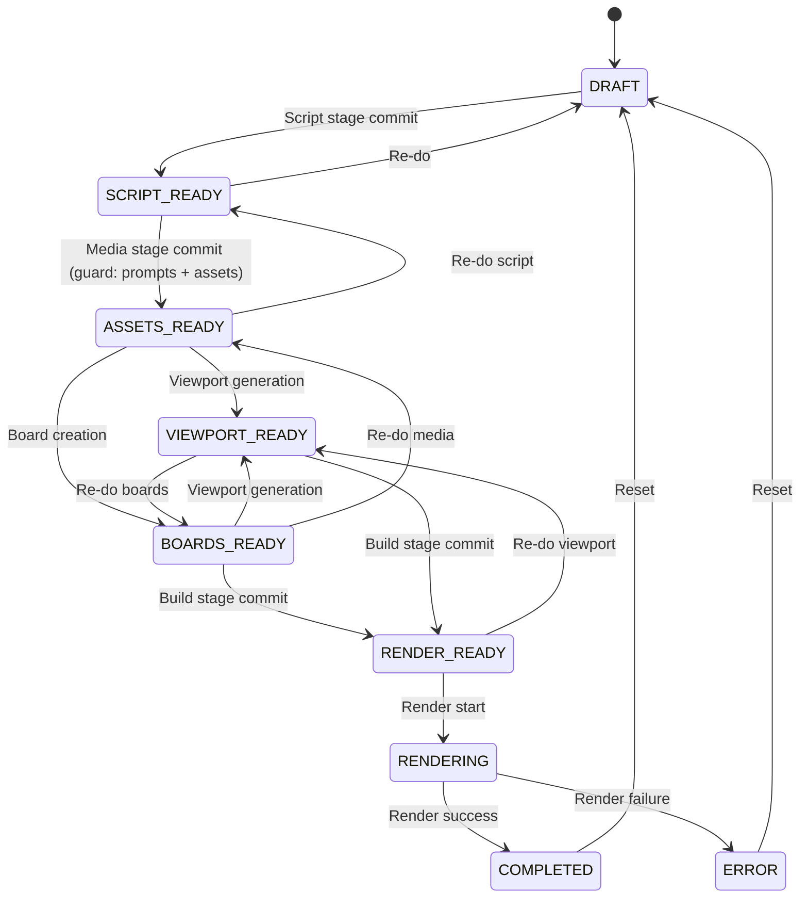
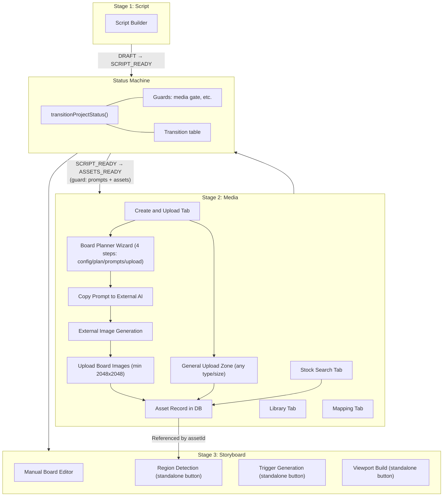

# Prompt-First Media Flow Implementation Plan

## Decisions Made

- **Status machine**: Introduce a lightweight `transitionProjectStatus()` function as the single enforcer for all project status changes. All routes that currently do raw `prisma.project.update({ data: { status } })` must go through this function. The transition table defines valid edges; guards enforce prerequisites (e.g., prompts + assets for media gate). No external library — just a `Record<Status, Status[]>` and a ~50-line function in `src/lib/storyflow/status-machine.ts`.
- **Canonical storage**: All images stored as `Asset` records under `assets/images/` -- board metadata references Asset IDs (Option B)
- **Style guide**: Wire through the full chain (UI -> API -> service), replacing hardcoded detective style
- **Prompt UI**: Move the first 4 wizard steps (`config -> plan -> prompts -> upload`) from Storyboard to Media, replacing the upload tab with a combined "Create and Upload" tab. Region detection, trigger generation, and viewport build remain in Storyboard.
- **Media gate**: Completion requires both prompts generated AND at least 1 asset
- **Board upload route**: Remove entirely; all uploads go through media/asset route
- **Grid layout**: Make rows/cols configurable in the wizard UI
- **Auto-promotion removal**: Remove ALL auto-promotion logic — not just `assets/upload`, but also `assets/import` (line 53-58), `projects/[id]/music` (line 134-139), `projects/[id]/boards` POST (line 42-47), `projects/[id]/boards/[boardId]` PUT (line 36-41), `projects/[id]/viewport` POST (line 44-50), `src/lib/storyflow/viewport.ts` (line 266-271), `src/lib/storyflow/scripts.ts` (line 53-56), and `src/lib/storyflow/render.ts` (lines 40-43, 51-54, 116-119). The generic project PATCH route (`app/api/projects/[id]/route.ts`) also accepts arbitrary status values — `status` must be removed from its schema entirely. The `project.updateStatus()` Prisma extension in `src/lib/storyflow/prisma.ts` (lines 73-77) is a latent bypass and must be removed. After Phase 0, all transitions go through `transitionProjectStatus()` which enforces the transition table and guards.
- **Migration strategy**: Clean slate -- remove existing project data and reset the database. No migration utility for existing `boards/` images is needed. Clean slate runs before Prisma schema changes to avoid `db:push` failures.
- **Shipping order**: Phase 0 ships first (status machine + bug fixes). Phase 1-2 ship together. Phase 3 follows immediately after. Standalone board operation buttons (region/trigger/viewport) are disabled in Phase 2 and enabled in Phase 3.
- **Wizard state persistence**: Wizard progress is persisted to the database via a `wizardProgress` JSON field on the Project model, ensuring state survives tab switches and page refreshes.
- **Board image naming**: Uploaded board images are renamed to `{boardId}.png` (or appropriate extension) to preserve the naming convention used by `viewport-service.ts`'s `checkUpscaledImages()`.
- **Storyboard mode switcher**: Remove entirely -- always show `SimpleBoardsEditor` since the AI wizard has moved to Media.
- **VIEWPORT_READY status**: Kept as-is. It remains a transitional status between `ASSETS_READY` and `RENDER_READY`, mapped to the "build" stage. The status machine explicitly allows `ASSETS_READY → VIEWPORT_READY` and `VIEWPORT_READY → RENDER_READY` transitions.
- **Backward transitions**: Any non-RENDERING status can transition to any earlier status, allowing users to re-do stages without a full reset to DRAFT. For example, `BOARDS_READY → ASSETS_READY` allows re-doing the media step, and `RENDER_READY → SCRIPT_READY` allows re-doing the script. `RENDERING` cannot be interrupted — only `COMPLETED` and `ERROR` can reset to `DRAFT`.
- **Board record creation timing**: Board DB records are created during the plan generation step in the Media wizard (`POST /api/projects/[id]/boards/plan`), not in Storyboard. This ensures `boardId` values exist before the upload step, which needs them for file naming (`{boardId}.png`).
- **Concurrency**: The status machine does not use optimistic locking or database transactions. This is accepted as low risk for single-user workflows. Concurrent status updates are rare and the system is not exposed as a public API.

---

## ✅ Phase 0: Status Machine & Bug Fixes (Foundation)

Establish a single enforcer for all project status transitions. This eliminates the pipeline integrity problem where 10+ locations bypass the stage system with raw `prisma.project.update({ status })` calls.

### 0.1 Create `transitionProjectStatus()`

Create a new file [src/lib/storyflow/status-machine.ts](src/lib/storyflow/status-machine.ts):

```typescript
import { ConflictError } from "@/app/api/lib";
import { storyflowPrisma } from "@/src/lib/storyflow/prisma";
import { ProjectStatus } from "@/src/lib/storyflow/types";

// All valid status transitions. If an edge isn't here, it's not allowed.
// Forward transitions advance the pipeline. Backward transitions allow re-doing
// earlier stages without a full reset. Any non-RENDERING status can move to any
// earlier status. RENDERING cannot be interrupted.
const TRANSITIONS: Record<ProjectStatus, ProjectStatus[]> = {
  DRAFT:           ["SCRIPT_READY"],
  SCRIPT_READY:    ["ASSETS_READY", "DRAFT"],
  ASSETS_READY:    ["VIEWPORT_READY", "BOARDS_READY", "SCRIPT_READY", "DRAFT"],
  BOARDS_READY:    ["VIEWPORT_READY", "RENDER_READY", "ASSETS_READY", "SCRIPT_READY", "DRAFT"],
  VIEWPORT_READY:  ["RENDER_READY", "BOARDS_READY", "ASSETS_READY", "SCRIPT_READY", "DRAFT"],
  RENDER_READY:    ["RENDERING", "VIEWPORT_READY", "BOARDS_READY", "ASSETS_READY", "SCRIPT_READY", "DRAFT"],
  RENDERING:       ["COMPLETED", "ERROR"],
  COMPLETED:       ["DRAFT"],     // Allow reset-to-draft
  ERROR:           ["DRAFT"],
};

export type TransitionGuardContext = {
  projectId: string;
};

export type TransitionGuard = (ctx: TransitionGuardContext) => Promise<void>;

// Guards run BEFORE the transition is committed.
// Keyed by "FROM → TO" string for readability. Multiple guards per transition
// are supported — they run sequentially and any can reject by throwing.
const GUARDS: Record<string, TransitionGuard[]> = {};

export function registerGuard(from: ProjectStatus, to: ProjectStatus, guard: TransitionGuard) {
  const key = `${from} → ${to}`;
  if (!GUARDS[key]) GUARDS[key] = [];
  GUARDS[key].push(guard);
}

export async function transitionProjectStatus(
  projectId: string,
  targetStatus: ProjectStatus
): Promise<void> {
  const project = await storyflowPrisma.project.findByIdOrThrow(projectId);
  const current = project.status as ProjectStatus;

  if (current === targetStatus) return; // no-op

  const allowed = TRANSITIONS[current] ?? [];
  if (!allowed.includes(targetStatus)) {
    throw new ConflictError(
      `Cannot transition from ${current} to ${targetStatus}. Allowed: [${allowed.join(", ")}]`
    );
  }

  const guardKey = `${current} → ${targetStatus}`;
  const guards = GUARDS[guardKey] ?? [];
  for (const guard of guards) {
    await guard({ projectId });
  }

  await storyflowPrisma.project.update({
    where: { id: projectId },
    data: { status: targetStatus },
  });
}
```

Key design points:
- **~50 lines**, no external dependencies. The transition table is a plain `Record`.
- **Guards** are registered separately (e.g., the media gate guard for `SCRIPT_READY → ASSETS_READY`). This keeps the machine pure and guards domain-specific.
- **Idempotent**: If `current === target`, it's a no-op (no error, no DB write).
- **Pipeline stage `commit()` functions** should call `transitionProjectStatus()` instead of raw Prisma updates. The `runStage()` orchestrator in `pipeline/runner.ts` already validates `allowedStatuses` before calling `commit()` — the status machine provides the second line of defense.

### 0.2 Replace all raw status updates

Ten locations currently bypass the pipeline with direct `prisma.project.update({ data: { status } })`:

| # | File | Lines | Current Bypass | Action |
|---|------|-------|----------------|--------|
| 1 | `app/api/assets/upload/route.ts` | 70-75 | `DRAFT/SCRIPT_READY → ASSETS_READY` | **Remove entirely.** Asset upload should not advance status. Status only advances via explicit "Complete Media" button (`MediaStageButton`). |
| 2 | `app/api/assets/import/route.ts` | 53-58 | `DRAFT/SCRIPT_READY → ASSETS_READY` | **Remove entirely.** Same reasoning as #1. |
| 3 | `app/api/projects/[id]/music/route.ts` | 134-139 | `DRAFT/SCRIPT_READY → ASSETS_READY` | **Remove entirely.** Same reasoning as #1. |
| 4 | `app/api/projects/[id]/boards/route.ts` | 41-47 | `ASSETS_READY/BOARDS_READY → RENDER_READY` | **Replace** with `transitionProjectStatus(id, "BOARDS_READY")`. Creating a board should not skip to `RENDER_READY`. |
| 5 | `app/api/projects/[id]/boards/[boardId]/route.ts` | 36-41 | `ASSETS_READY/BOARDS_READY → RENDER_READY` | **Replace** with `transitionProjectStatus(id, "BOARDS_READY")`. Updating a board should not skip to `RENDER_READY`. |
| 6 | `app/api/projects/[id]/viewport/route.ts` | 44-50 | `ASSETS_READY/VIEWPORT_READY → RENDER_READY` | **Replace** with `transitionProjectStatus(id, "RENDER_READY")` — but only from `VIEWPORT_READY`. The machine enforces the valid edge. |
| 7 | `src/lib/storyflow/viewport.ts` | 266-271 | `ASSETS_READY → VIEWPORT_READY` | **Replace** with `transitionProjectStatus(projectId, "VIEWPORT_READY")`. |
| 8 | `src/lib/storyflow/scripts.ts` | 53-56 | `Any → SCRIPT_READY` | **Replace** with `transitionProjectStatus(projectId, "SCRIPT_READY")`. |
| 9 | `src/lib/storyflow/render.ts` | 40-43, 51-54, 116-119 | `→ RENDERING`, `→ ERROR`, `→ COMPLETED` | **Replace** all three with `transitionProjectStatus(projectId, ...)` for `RENDERING`, `ERROR`, and `COMPLETED` respectively. |
| 10 | `app/api/projects/[id]/route.ts` | 53 | PATCH accepts **any status** via request body | **Remove `status` from `updateProjectSchema`** entirely. Status must only be set through `transitionProjectStatus()`. This is the most dangerous bypass — it allows a caller to set any status with zero validation. |

Additionally, **remove the `project.updateStatus()` Prisma extension** from [src/lib/storyflow/prisma.ts](src/lib/storyflow/prisma.ts) lines 73-77. This helper performs a raw `prisma.project.update({ data: { status } })` and is a latent bypass. It is currently unused in production code but could be called accidentally. Remove both the method implementation and its type signature from `StoryflowPrismaClient`.

Additionally, update the **4 pipeline stage `commit()` functions** to call `transitionProjectStatus()`:
- `pipeline/stages/script.ts` — commit updates to `SCRIPT_READY`
- `pipeline/stages/media.ts` — commit updates to `ASSETS_READY`
- `pipeline/stages/storyboard.ts` — commit updates to `BOARDS_READY`
- `pipeline/stages/build.ts` — commit updates to `RENDER_READY`

Each stage `commit()` currently has its own status-downgrade prevention logic (e.g., "don't update if already `BOARDS_READY`"). This logic moves into the transition table — the machine structurally prevents invalid transitions, so the `commit()` functions become simpler.

### 0.3 Fix pre-existing bugs

Two bugs found during codebase audit:

1. **Missing `NotFoundError` import** — [app/api/projects/[id]/boards/triggers/route.ts](app/api/projects/[id]/boards/triggers/route.ts) line ~6: Add `NotFoundError` to the import from `@/app/api/lib`. The GET handler at line ~180 throws `NotFoundError` but it's not imported, causing a runtime crash when no triggers file exists.

2. **`STAGE_COMPLETION_CRITERIA` for media is stale** — [src/lib/storyflow/stage-validation.ts](src/lib/storyflow/stage-validation.ts) line 22: Currently says `"User clicks Continue to Storyboard."`. Update to `"Image prompts generated and at least 1 asset uploaded."` to match the new gate requirement.

**Note**: The `useUpdateBoard` hook in [src/hooks/queries/use-boards.ts](src/hooks/queries/use-boards.ts) was initially identified as dead, but the `PUT /api/projects/[id]/boards/[boardId]` route **does exist** at [app/api/projects/[id]/boards/[boardId]/route.ts](app/api/projects/[id]/boards/[boardId]/route.ts). The hook is functional. The route's raw status bypass (`ASSETS_READY/BOARDS_READY → RENDER_READY`) is now covered by Phase 0.2 row #5.

---

## ✅ Phase 1: Consistency Fixes (Low Risk)

Quick copy/text fixes and style guide wiring with no structural changes.

### ✅ 1.1 Fix stale "Assets page" text

- [components/boards/BoardPlannerWizard.tsx](components/boards/BoardPlannerWizard.tsx) line ~421: Change "Assets page" references to "Media page"
- [components/boards/BoardPlannerWizard.tsx](components/boards/BoardPlannerWizard.tsx) line ~432: Fix instruction text about upload destination

### ✅ 1.2 Wire style guide end-to-end

Four files need changes:

1. **API schema** -- [app/api/projects/[id]/boards/prompts/route.ts](app/api/projects/[id]/boards/prompts/route.ts): Add `styleGuide: z.string().optional()` to `requestSchema`
2. **API client type** -- [src/lib/api/boards.ts](src/lib/api/boards.ts): Add `styleGuide?: string` to `GeneratePromptsInput` interface (line ~99)
3. **Prompt service** -- [src/lib/boards/prompts-service.ts](src/lib/boards/prompts-service.ts): Accept `styleGuide` parameter in `generateBoardPrompts()`, use it instead of hardcoded `DETECTIVE_BOARD_STYLE_GUIDE` (fall back to detective if not provided)
4. **Wizard UI** -- [components/boards/BoardPlannerWizard.tsx](components/boards/BoardPlannerWizard.tsx) lines ~96-103: Include `styleGuide` in the mutation payload

### ✅ 1.3 Make grid layout configurable

- [components/boards/BoardPlannerWizard.tsx](components/boards/BoardPlannerWizard.tsx): Add `rows`/`cols` state (default 2x3), render number inputs near the style guide field, pass to mutation payload instead of hardcoded `{ rows: 2, cols: 3 }`

---

## Phase 2: Move Wizard to Media Page

Relocate the prompt generation wizard from Storyboard to Media, restructuring the tab layout.

### 2.1 Replace upload tab with "Create and Upload" tab

**Scope the wizard for Media context:**

The `BoardPlannerWizard` has 7 steps (`config -> plan -> prompts -> upload -> regions -> triggers -> viewport`). Only the first 4 steps (`config -> plan -> prompts -> upload`) belong on the Media page. Region detection, trigger generation, and viewport build remain in Storyboard.

- [components/boards/BoardPlannerWizard.tsx](components/boards/BoardPlannerWizard.tsx):
  - Add a `mode` prop: `"media" | "storyboard"` (default `"storyboard"` for backward compatibility)
  - Add `images: Asset[]` and `initialBoards: Board[]` props (used in media mode to pre-populate wizard state and display existing uploads)
  - When `mode === "media"`: only render steps `config | plan | prompts | upload`; hide the step indicators and navigation for `regions | triggers | viewport`
  - When `mode === "storyboard"`: render all 7 steps (existing behavior, used until Phase 2.2 removes it)

**Restructure Media page tabs:**

- [components/media/media-manager.tsx](components/media/media-manager.tsx):
  - Change tab definitions from `upload | stock | library | mapping` to `create | stock | library | mapping`
  - The `create` tab renders a two-section layout (no AssetGallery -- uploaded assets are viewable in the `library` tab only):
    1. **Prompt generation section** -- embed `BoardPlannerWizard` with `mode="media"` (shows only config/plan/prompts/upload steps). The wizard's upload step is for AI-generated board images (high-resolution, min 2048x2048).
    2. **General upload section** -- keep existing `UploadZone` below the wizard for general-purpose media uploads (any type, any size). Add a visual separator and label distinguishing this from the wizard upload.
  - Accept two new props: `images: Asset[]` (filtered from existing assets), `initialBoards: Board[]` (default `[]`). Note: `script: Script | null` is already an existing prop.
  - Pass `projectId`, `script`, `images`, and `initialBoards` through to `BoardPlannerWizard`

- [app/(dashboard)/projects/[id]/media/page.tsx](app/(dashboard)/projects/[id]/media/page.tsx):
  - Fetch script data alongside project data (already available via RSC query)
  - Filter `project.assets` to `IMAGE` type for the `images` prop
  - Pass `script`, `images`, and `initialBoards={[]}` to `MediaManager`

### 2.1d Wizard state persistence

The wizard is embedded in a tab within the Media page. Wizard state (current step, generated plan, prompts, partial progress) must survive tab switches and page refreshes.

- [prisma/storyflow.schema.prisma](prisma/storyflow.schema.prisma): Add a `wizardProgress` JSON field to the `Project` model:
  ```
  wizardProgress Json?  // Tracks board planner wizard step and partial state
  ```
  Run `npm run db:generate:storyflow && npm run db:push:storyflow` after adding the field.
- [components/boards/BoardPlannerWizard.tsx](components/boards/BoardPlannerWizard.tsx):
  - On mount: hydrate wizard state from `wizardProgress` (loaded via project query). If artifact files already exist on the server (`board-plan.json`, `board-prompts.json`), use those as additional signals to determine completed steps.
  - On step transitions: persist the current step and relevant state to `wizardProgress` via a project update mutation.
  - This ensures that if a user generates a plan, switches to the Stock tab, then returns to the Create tab, the wizard resumes at the correct step with existing data intact.
- Add an API endpoint or extend the existing project update route to accept `wizardProgress` updates.

### 2.1e Create Board DB records during plan generation

Board DB records must exist before the upload step so that `boardId` values are available for file naming (`{boardId}.png`). In the current architecture, boards are created in Storyboard. With prompts moving to Media, board records need to be created earlier.

- [app/api/projects/[id]/boards/plan/route.ts](app/api/projects/[id]/boards/plan/route.ts): Update the plan route to **upsert Board rows** in the database alongside writing `board-plan.json`. For each board in the generated plan:
  - Create a `Board` record with the plan's `boardId`, `projectId`, `index`, `layout` (from grid config), and `plan` (segment groupings)
  - Use upsert to handle re-generation: if a Board with the same `projectId` and `index` already exists, update it; otherwise create it
  - Delete any Board records whose indices exceed the new plan's board count (handles plan size changes)
- This ensures that when the wizard reaches the upload step, each board slot has a corresponding `boardId` in the database that can be passed as form data to the asset upload route
- In Storyboard, `SimpleBoardsEditor` renders these boards (already created during plan generation) and allows region detection, trigger generation, and viewport build operations

### 2.2 Remove wizard from Storyboard and add standalone board operations (Completed)

- [components/boards/BoardsWorkflow.tsx](components/boards/BoardsWorkflow.tsx):
  - AI/manual toggle removed; `SimpleBoardsEditor` always renders.
  - Added `Alert` guiding users to the Media page for prompt generation, with link.
  - Added board selector plus standalone buttons for regions/triggers/viewport, rendered disabled with tooltips until Phase 3 (image storage migration).
- [app/(dashboard)/projects/[id]/storyboard/page.tsx](app/(dashboard)/projects/[id]/storyboard/page.tsx): Wizard props removed; page passes boards/images only.

### 2.3 Register media gate guard (Completed)

Auto-promotion removal is already handled by Phase 0.2. This step adds the strengthened media gate as a **guard** on the `SCRIPT_READY → ASSETS_READY` transition in the status machine.

**Existing UI trigger**: The `MediaStageButton` component ([components/pipeline/media-stage-button.tsx](components/pipeline/media-stage-button.tsx)) is the explicit UI for media completion. It calls `useRunMediaStage` → `POST /api/projects/[id]/media/stage` → `runMediaStage()` from `pipeline/stages/media.ts`. The enforcement chain is: `MediaStageButton` → `useRunMediaStage` → `POST /media/stage` → `runMediaStage()` → `mediaStage.commit()` → `transitionProjectStatus(projectId, "ASSETS_READY")` → media gate guard runs. No new button is needed — the guard is enforced transparently through the existing pipeline stage.

**Register the guard:**

- [src/lib/storyflow/status-machine.ts](src/lib/storyflow/status-machine.ts) or a separate guards file:
  - Call `registerGuard("SCRIPT_READY", "ASSETS_READY", mediaGateGuard)` at module load
  - The `mediaGateGuard` function:
    - Check for board prompts file (`boards/board-prompts.json`): read the file, parse as JSON, and validate that it contains a non-empty `prompts` array. A missing, empty, or malformed file means prompts are not yet generated (gate stays closed). Do NOT use bare `fs.existsSync()` -- a truncated or empty file would pass an existence-only check.
    - Check for asset count (existing `storyflowPrisma.asset.count()` logic)
    - Require BOTH: prompts generated AND at least 1 asset
    - Throw `ConflictError` with specific messages:
      - Missing prompts only: "Generate image prompts before marking Media complete."
      - Missing assets only: "Upload at least one asset before marking Media complete."
      - Missing both: "Generate image prompts and upload at least one asset before marking Media complete."

- [src/lib/storyflow/pipeline/stages/media.ts](src/lib/storyflow/pipeline/stages/media.ts):
  - Simplify `prepare()` — the guard handles prerequisite validation. The `prepare()` function can focus on extracting stage input data.
  - Update `commit()` to call `transitionProjectStatus(projectId, "ASSETS_READY")` (should already be done in Phase 0.2)

---

## Phase 3: Unify Image Storage (Asset Records Only)

Eliminate the split between board images (`boards/`) and media assets (`assets/images/`).

**Note**: There is a pre-existing path mismatch in the current codebase: the board upload route saves images to `boards/${boardId}.png`, but the viewport service (`src/lib/boards/viewport-service.ts` lines 81-113) expects images in `assets/images/`. This phase resolves that mismatch by unifying all image storage under `assets/images/` with `Asset` records.

### 3.1 Update ImageUploader to use asset upload (do BEFORE removing old route)

- [components/boards/ImageUploader.tsx](components/boards/ImageUploader.tsx):
  - Change from `useUploadBoardImage` to using the media asset upload route (`/api/assets/upload`)
  - The asset upload route returns `{ asset: Asset }` (not `{ imagePath, metadata }` like the board route). Update the `onUploadComplete` callback signature from `onUploadComplete(imagePath: string)` to `onUploadComplete(assetId: string)`
  - Update all consumers of `onUploadComplete` to handle the new `assetId` parameter (e.g., `RegionEditor`, `BoardPlanView`)
  - Keep minimum dimension validation (2048x2048) client-side only (accepted risk: no server-side dimension enforcement for board images via the generic asset upload route)
  - **Filename convention**: When uploading a board image, rename the file to `{boardId}.png` (or appropriate extension) before saving to `assets/images/`. This preserves the naming convention that `viewport-service.ts`'s `checkUpscaledImages()` relies on (it looks for `{boardId}.png` and `{boardId}_8k.png` in the images directory). The `boardId` should be passed as form data alongside the file.
  - After upload, store the Asset ID in board metadata instead of a file path

### 3.2 Remove board-specific upload route and hooks

Only after 3.1 is complete (ImageUploader no longer references old route/hook):

- Delete [app/api/projects/[id]/boards/upload-image/route.ts](app/api/projects/[id]/boards/upload-image/route.ts)
- Remove `useUploadBoardImage` hook from [src/hooks/queries/use-boards.ts](src/hooks/queries/use-boards.ts)
- Remove the `uploadBoardImage` API client function from [src/lib/api/boards.ts](src/lib/api/boards.ts)

### 3.3 Clean slate for existing data (BEFORE schema change)

Per decision, existing project data is removed rather than migrated. This step MUST run before 3.4 (schema change) because `db:push` on a schema change with existing data (removing `imagePath`, adding `assetId`) could fail or cause data loss errors.

- Delete existing project artifacts under `public/projects/`
- Reset the database (`npm run db:push:storyflow`)
- No migration utility is required

### 3.4 Update board metadata, Prisma schema, and types to reference Asset IDs

**Prisma schema change:**

- [prisma/storyflow.schema.prisma](prisma/storyflow.schema.prisma): In the `Board` model, replace `imagePath String?` with `assetId String?` and add a relation:
  ```
  assetId  String?
  asset    Asset?   @relation(fields: [assetId], references: [id])
  ```
  Also add `boards Board[]` to the `Asset` model.
- Run `npm run db:generate:storyflow && npm run db:push:storyflow` after the schema change

**Type changes:**

- [src/lib/storyflow/types.ts](src/lib/storyflow/types.ts): In `BoardRegionsOutput`, change `imagePath: string` to `assetId: string`
- [src/lib/boards-types.ts](src/lib/boards-types.ts): In `BoardRegionsOutputSchema`, change `imagePath: z.string()` to `assetId: z.string()`
- [src/lib/storyflow/types.ts](src/lib/storyflow/types.ts): In the TypeScript `Board` interface (lines ~256-265), add `assetId?: string` (this interface currently has neither `imagePath` nor `assetId`; the Prisma model has `imagePath` which is being replaced)

**Service file updates:**

- [src/lib/boards/regions-service.ts](src/lib/boards/regions-service.ts): Resolve image path from `Asset` record instead of using a raw `imagePath` string
- [src/lib/boards/viewport-service.ts](src/lib/boards/viewport-service.ts): `checkUpscaledImages()` already looks in `assets/images/` -- update to resolve paths from `Asset` records for consistency
- Update [src/lib/boards/](src/lib/boards/) any other service files that read `imagePath` from `BoardRegionsOutput`

**Component updates:**

- [components/boards/BoardPlanView.tsx](components/boards/BoardPlanView.tsx), [components/boards/ViewportPreview.tsx](components/boards/ViewportPreview.tsx), and [components/boards/RegionEditor.tsx](components/boards/RegionEditor.tsx): Resolve image URLs from Asset records (fetch asset by ID to get its `path`). `RegionEditor` (line 46) uses `imagePath` for canvas rendering and must be updated alongside the other two components.

---

## Phase 4: Cleanup and Polish (completed)

### 4.1 Update wizard copy

- Remove any remaining references to "Assets page" or outdated navigation instructions (covered in earlier iterations)
- Ensure the "Create and Upload" tab copy guides users: generate prompts -> copy to external tool -> generate images -> upload back

### 4.2 Update tests

- **Status machine tests** — Add `src/lib/storyflow/__tests__/status-machine.test.ts`:
  - Test every valid transition succeeds
  - Test every invalid transition throws `ConflictError`
  - Test guard registration and execution (media gate guard)
  - Test idempotent behavior (same status → no-op)
- [app/api/projects/**tests**/boards.test.ts](app/api/projects/__tests__/boards.test.ts): Update prompt generation tests to include `styleGuide` parameter. Update board creation test — no longer expects `RENDER_READY` auto-promotion.
- [app/api/projects/**tests**/media.test.ts](app/api/projects/__tests__/media.test.ts): Update media stage gate tests for new dual requirement (prompts + assets)
- [app/api/assets/__tests__/routes.test.ts](app/api/assets/__tests__/routes.test.ts): Remove assertions that expect auto-promotion to `ASSETS_READY` on upload/import
- Add tests for the removed board upload route (verify 404)
- Update any snapshot or integration tests affected by tab restructuring

### 4.3 Update documentation

- [docs/regression-checklist.md](docs/regression-checklist.md): Update boards flow from "Prompts -> Upload" to reflect new Media-based flow (completed).
- [docs/media-prompt-manual-image-flow-analysis-2026-02-07.md](docs/media-prompt-manual-image-flow-analysis-2026-02-07.md): Update the analysis doc to mark items as resolved and restate the dual requirement (prompts + assets) and asset-id storage (completed).

---

## Architecture After Changes

### Status Machine — Transition Table



All transitions go through `transitionProjectStatus()` — no route can bypass this. Any non-RENDERING status can also transition to any earlier status (not all backward edges shown for readability — see transition table in Phase 0.1 for the full set).

### Pipeline Flow




---

## Risk Mitigation

- **Phase 0** is low risk — adds a new module (`status-machine.ts`) and replaces raw Prisma calls with calls to it. The transition table codifies the exact same edges that currently exist (no behavioral change for valid flows). Invalid flows that previously worked (e.g., `ASSETS_READY → RENDER_READY` via board creation) will now throw `ConflictError`. Test by running the full pipeline once and verifying each stage advances correctly.
- **Phase 0 rollback**: If the status machine causes unexpected issues, each route's raw `prisma.update` call is preserved in git history and can be reverted individually.
- **Phase 1** is safe -- text changes and additive parameter threading
- **Phase 2** is medium risk -- moving UI between pages, changing tab structure. Test thoroughly with existing projects. Phase 2 ships with a TODO/deprecation notice on the board upload route; the board upload route remains functional until Phase 3. Standalone board operation buttons (region/trigger/viewport) are rendered disabled in Phase 2 with tooltips indicating they require Phase 3.
- **Phase 3** is highest risk -- changing storage model, Prisma schema, and type contracts. Mitigated by clean-slate approach (no migration needed). Clean slate (3.3) runs before schema changes (3.4) to avoid `db:push` failures. All changes are atomic within this phase.
- **Pre-existing bugs fixed in Phase 0.3**: Missing `NotFoundError` import in triggers route (runtime crash), stale stage completion criteria text. Note: `useUpdateBoard` was initially reported as dead but the `PUT /boards/[boardId]` route exists — the route's raw status bypass is covered by Phase 0.2.
- **Pre-existing bug**: The current codebase has a path mismatch -- board upload saves to `boards/` but the viewport service (`viewport-service.ts`) expects images in `assets/images/`. Phase 3 resolves this by unifying storage under `assets/images/` via Asset records.
- **Accepted risk -- client-side-only dimension validation**: Board images require a minimum of 2048x2048px, but this is enforced only client-side in `ImageUploader`. The generic asset upload route (`/api/assets/upload`) does not perform board-specific dimension checks. A direct API caller could bypass this. This is accepted because board image uploads are an internal workflow, not a public API.
- **Accepted risk -- no concurrency protection in status machine**: The `transitionProjectStatus()` function reads the current status, runs guards, then writes the new status without optimistic locking or database transactions. Two concurrent requests could both read the same status and write conflicting target statuses (last write wins). This is accepted because: (a) the system is a single-user creative workflow, not a multi-tenant API; (b) concurrent status transitions are extremely rare in normal use; (c) adding serializable transactions or optimistic locking would add complexity disproportionate to the risk. If concurrent status updates become a problem in the future, add a `WHERE status = :expectedStatus` clause to the UPDATE query and throw `ConflictError` if 0 rows are affected.
- Each phase should be a separate PR with its own test pass against [docs/regression-checklist.md](docs/regression-checklist.md)

---

## Appendix: Routes Audited for Status Bypasses

All locations that previously performed raw `prisma.project.update({ data: { status } })`:

| Route | File | Lines | Old Behavior | Phase 0 Action |
|-------|------|-------|-------------|----------------|
| Asset upload | `app/api/assets/upload/route.ts` | 70-75 | `DRAFT/SCRIPT_READY → ASSETS_READY` | Remove (no auto-promotion) |
| Asset import | `app/api/assets/import/route.ts` | 53-58 | `DRAFT/SCRIPT_READY → ASSETS_READY` | Remove (no auto-promotion) |
| Music select | `app/api/projects/[id]/music/route.ts` | 134-139 | `DRAFT/SCRIPT_READY → ASSETS_READY` | Remove (no auto-promotion) |
| Board create | `app/api/projects/[id]/boards/route.ts` | 41-47 | `ASSETS_READY/BOARDS_READY → RENDER_READY` | Replace with `transitionProjectStatus(id, "BOARDS_READY")` |
| Board update | `app/api/projects/[id]/boards/[boardId]/route.ts` | 36-41 | `ASSETS_READY/BOARDS_READY → RENDER_READY` | Replace with `transitionProjectStatus(id, "BOARDS_READY")` |
| Viewport save | `app/api/projects/[id]/viewport/route.ts` | 44-50 | `ASSETS_READY/VIEWPORT_READY → RENDER_READY` | Replace with `transitionProjectStatus(id, "RENDER_READY")` |
| Viewport gen | `src/lib/storyflow/viewport.ts` | 266-271 | `ASSETS_READY → VIEWPORT_READY` | Replace with `transitionProjectStatus(projectId, "VIEWPORT_READY")` |
| Script save | `src/lib/storyflow/scripts.ts` | 53-56 | `Any → SCRIPT_READY` | Replace with `transitionProjectStatus(projectId, "SCRIPT_READY")` |
| Render start | `src/lib/storyflow/render.ts` | 40-43 | `→ RENDERING` | Replace with `transitionProjectStatus(projectId, "RENDERING")` |
| Render error | `src/lib/storyflow/render.ts` | 51-54 | `→ ERROR` | Replace with `transitionProjectStatus(projectId, "ERROR")` |
| Render complete | `src/lib/storyflow/render.ts` | 116-119 | `→ COMPLETED` | Replace with `transitionProjectStatus(projectId, "COMPLETED")` |
| Project PATCH | `app/api/projects/[id]/route.ts` | 53 | Any status via request body | Remove `status` from `updateProjectSchema` entirely |
| Prisma extension | `src/lib/storyflow/prisma.ts` | 73-77 | `project.updateStatus()` helper | Remove method and type signature |
| Script stage | `pipeline/stages/script.ts` | commit() | `→ SCRIPT_READY` | Replace with `transitionProjectStatus()` |
| Media stage | `pipeline/stages/media.ts` | commit() | `→ ASSETS_READY` | Replace with `transitionProjectStatus()` |
| Storyboard stage | `pipeline/stages/storyboard.ts` | commit() | `→ BOARDS_READY` | Replace with `transitionProjectStatus()` |
| Build stage | `pipeline/stages/build.ts` | commit() | `→ RENDER_READY` | Replace with `transitionProjectStatus()` |
